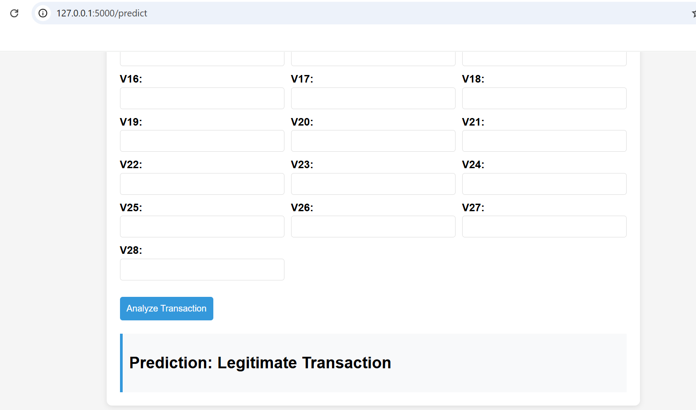

# Credit Card Fraud Detection 🔍

A machine learning-based system to detect fraudulent transactions using the creditcard.csv dataset. This project focuses on class imbalance handling, training both supervised and unsupervised models, and deploying the best model with a Flask interface.

---

### 📌 Key Features:

- **Class Imbalance Handling**: Used SMOTE to balance dataset.
- **Models Trained**:
  - Supervised: Random Forest, XGBoost, Logistic Regression
  - Unsupervised: Isolation Forest, Autoencoders
- **Evaluation Metrics**: Precision, Recall, F1-Score, ROC-AUC
- **Best Model**: Random Forest (ROC-AUC: 97%+)
- **Feature Importance**: Visualized key contributors to fraud detection

---

### 🚀 Deployment

The trained Random Forest model is deployed using Flask with a simple web interface to input transaction data and get predictions in real-time.

---

### 📸 Sample Prediction Output

---

### 📂 Dataset

- [Credit Card Dataset (Kaggle Mirror)](https://drive.google.com/file/d/1o1MwgITrVhQntjW1oEYDt7VYwaK4G7xK/view?usp=sharing)

